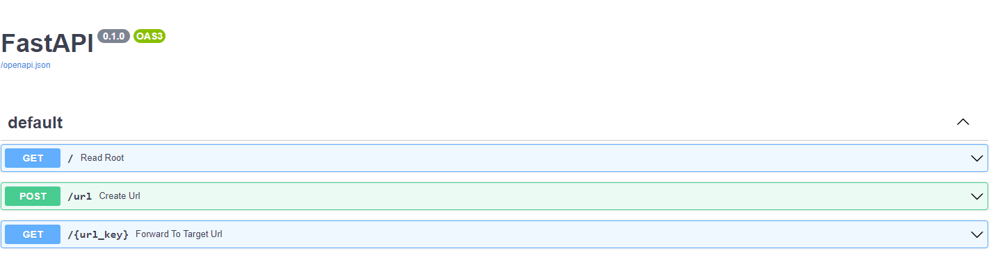

<h1 align="center">Python URL Shortener </h1>

<h5> URLs can be extremely long and not user-friendly. A URL shortener reduces the number of characters in a URL, making it easier to read, remember, and share.</h5>

##   <b>Approach</b>


- Use REST API with FastAPI
- Run web server with Uvicorn
- Use SQLite database and interact with it with CRUD operations

##  <b> API</b>




 ## 💻 How to setup:


Creating conda environment
```
conda create -p venv python==3.8 -y
```

activate conda environment
```
conda activate ./env
```

Install requirements
```
pip install -r requirements.txt
```

To launch swagger ui
```
http://127.0.0.1:8000/docs
```
Check data in database
```
- Open Python Interpreter & run below commands

        from url_shortener_app.database import SessionLocal
        db = SessionLocal()
        from url_shortener_app.models import URL
        db.query(URL).all()
```
 API responds with the data
 ```
    {
    "target_url": "https://www.python.org/",
    "is_active": true,
    "clicks": 0,
    "url": "LPWLN",
    "admin_url": "JCXBRLJB"
    }

    http://127.0.0.1:8000/LPWLN forwards successfully to https://www.python.org/.com.
 ```
 ## <b> Technologies Used</b>


 <p align="center">

 1. FastApi
 2. SQLite database

 ## 🏭 Industrial Use-cases 


 - Shortened URLs are more streamlined in appearance
 - Shortened URLs are Easier to replicate
 
 ## 👋 Conclusion

  With yourour URL shortener wecan now convert long URLs into tiny, shareable links. 
